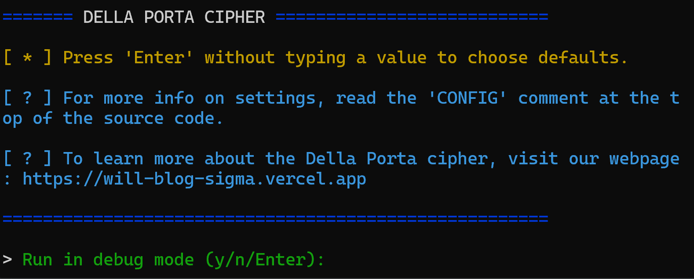

# Della Porta Cipher

[The Della Porta cipher](https://sites.google.com/site/cryptocrackprogram/user-guide/cipher-types/substitution/porta) is an cryptography process that allows one to encrypt or decrypt plain text into a readable or obfuscated form.

This is our Java implementation of the algorithm for doing so, created as a college project by Will, Jaylen, and Alex. We call it *"The Shifting Method"*.

## Compilation

To compile the Java file, simply `git clone` this repository and enter this command in your terminal in the project directory:

`java src/DellaPortaCipher.java`

If your system supports ASCII console colors, then you can run the command with a `colors` command argument:

`java src/DellaPortaCipher.java colors`

and your command line should now render as:

 

For more information on the process behind our algorithm, visit our [website here](https://will-blog-sigma.vercel.app/). 